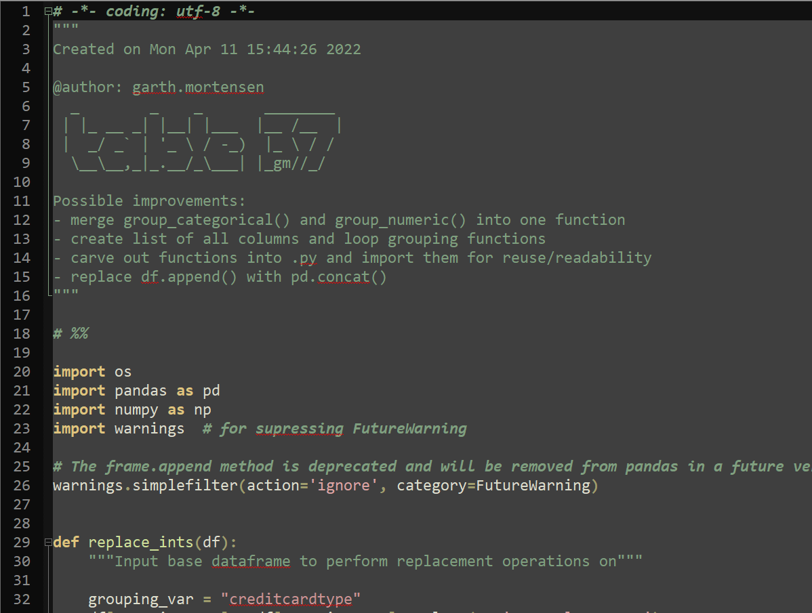
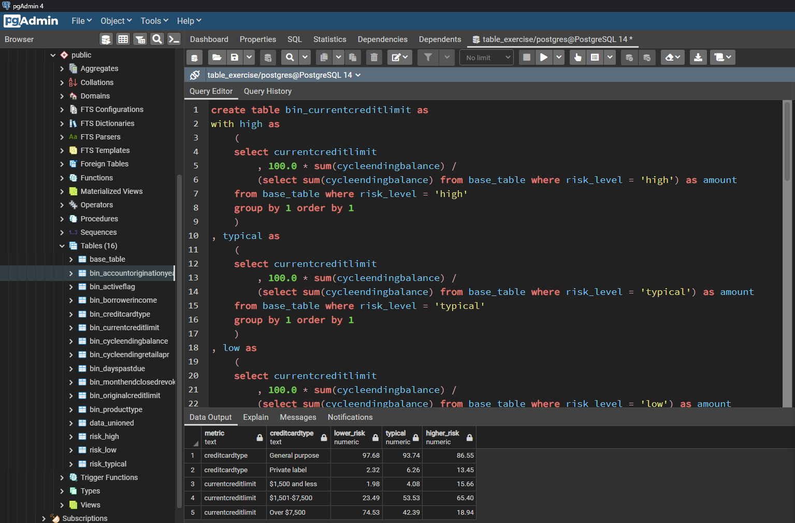
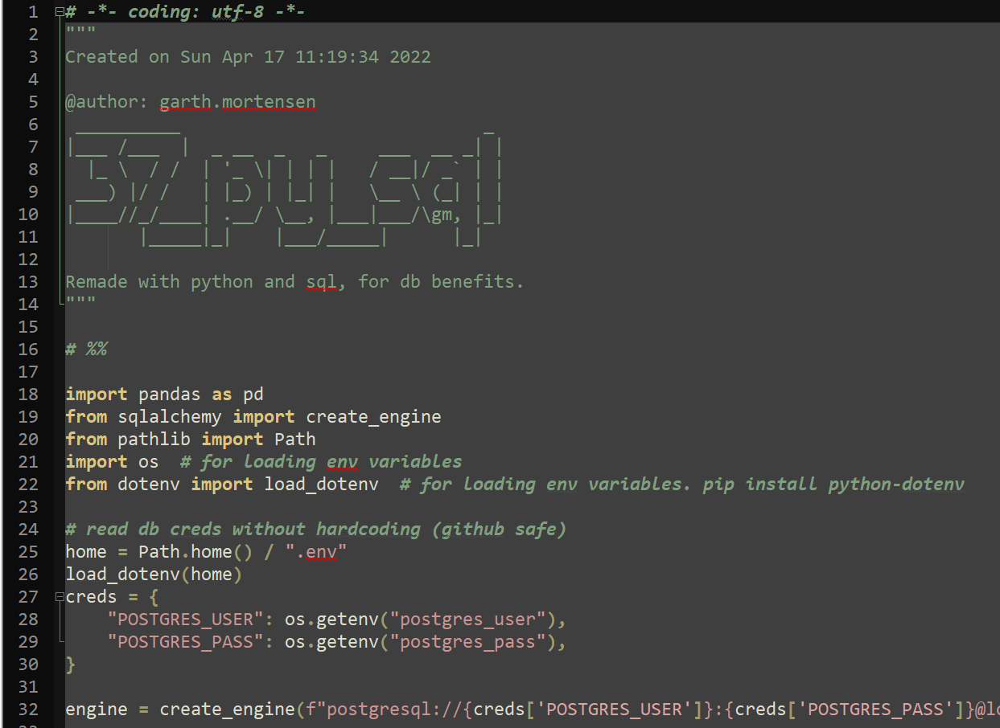

# Card stats

Read .csv files in and reproduce the table.

## Requirements

In less than 4 hours, reproduce table 37 in the following pdf:

https://www.federalreserve.gov/publications/files/2022-march-supervisory-stress-test-methodology.pdf

## Data

The three input .csv data files are archived in `./data/input/`.

The files are sourced from here:

https://www.federalreserve.gov/supervisionreg/files/cards-high-risk-2022.csv

https://www.federalreserve.gov/supervisionreg/files/cards-typical-risk-2022.csv

https://www.federalreserve.gov/supervisionreg/files/cards-low-risk-2022.csv

## Approaches

Three approaches were explored for the exercise.

The first was done in python, the second used sql, and the third combined python and sql.

### 1. python

`table_37.py` reads data directly from urls, processes the data, and exports each file as both .csv and .html.

At the end of the script, I realized that I couldn't join on the indices, since some of the index values repeat across columns. This caused a cartesian product. Refactoring the code to fix that would have exceeded time constraints.

All libraries/modules come with Anaconda distribution.



### 2. sql

`table_37.sql` creates table schemas, then after importing the .csv files, unions tables, does the calculation queries, then left joins them all, then unions.

This is method is a refactoring of the first approach, in sql. It doesn't handle all variables, since it's just highlighting how to fix the first method.

Postgres was used.



### 3. python + sql

`table_37_py_sql.py` was done just for closure.

Dependencies are stored in `requirements.txt`. Create a virtual environment and install using it:

```bash
pip install -r requirements.txt
```

The script uses [sqlalchemy](https://www.sqlalchemy.org/) and [psycopg](https://www.psycopg.org/) libraries to connect and interact with a postgres database. Queries are coded within the script, except for `query_case_when.sql` which was imported directly as a string, just to see if it would work. It did.



I store my environment variables in an external file. Lines 24-32 can be hardcoded to include your own username/passwords.